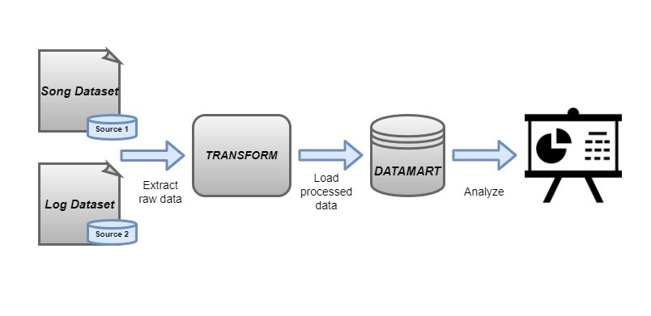

# Introduction

This project is an implementation of a datamart (using postgres database) for a startup know as Sparkify, using well designed ETL pipeline.   Based on the song and user-activity data collected by the Sparkify team in JSON files, a database is to be built. The Analytics team at Sparkify further aims to use this datbase for anlaysis as in to understand the user behaviour, like for example what songs do users like listening to, what music do the users prefer,etc.

# Dataset:
This project consumes data from two below JSON files:
### 1. <i>Song Dataset</i>

The first dataset consists of song files in JSON format. These files contain metadata about a song and the artist of that song. The files are partitioned by the first three letters of each song's track ID. Below is the snippet of example of how song dataset looks like:

### 2. <i>Log Dataset</i>

The second dataset consists of log files in JSON format generated by this event simulator based on the songs in the dataset above. The log files in the dataset are partitioned by year and month. Below is the snippet of example of how log dataset looks like:

# Database Plan:
Below is the conceptual design for the Sparkify datamart. Since the database is supposed to support heavy analytical queries, a star schema has been designed. Below image includes the different components of star schema, fact table : Songplays and the dimension tables : songs, artists, users, time.

# ETL Pipeline:
ETL processing has been implemented by using python libraries like pandas, os, psycopg2, sql_queries etc to first extract raw data from songs and logs dataset, data is then transformed to derive desired attributes for different tables(users, songs, artists, time, songplays) and processed information is then stored in the above mentioned tables of the Sparkify database. This information can further be used by Sparkify analytics team to perform further analysis.

# Project Files and Folders:
1. <b>Data:</b> Contains song and log datasets.
2. <b>create_tables.py:</b> contains queries to drop and create tables. You run this file to reset your tables before each time you run your ETL scripts.
3. <b>etl.ipynb:</b> reads and processes a single file from song_data and log_data and loads the data into your tables. This notebook contains detailed instructions on the ETL process for each of the tables.
4. <b>etl.py:</b> reads and processes files from song_data and log_data and loads them into your tables.
5. <b>sql_queries.py:</b> contains all sql queries, and is imported into the last three files above.
6. <b>test.ipynb:</b> displays the first few rows of each table to let you check your database.(Note:this notebook needs to be restarted to close connection to sparkifydb)
7. <b>sample_queries.ipynb:</b> contains sample queries that could be run by Sparkify analytics team.(Note:this notebook needs to be restarted to close connection to sparkifydb)
8. <b>README.md:</b> provides breif description about the project and how to run the files.

# Steps to run the project:
Follow the below steps to run the project:
1. create_tables.py : run this file to create DB, drop existing tables and create the newtables.
2. etl.py: run this file to read and process files from song_data and log_data and load the data into the above created tables.
3. test.ipynd: run this file to verify if the tables were created and loaded correctly.(Note:this notebook needs to be restarted to close connection to sparkifydb)

# Sample Queries:
Below sample queries can be found in the file-<b>sample_queries.ipynb</b>:

